# Installation Guide

This document provides a complete step-by-step guide to setting up the **Proxy Automation Environment** on **Ubuntu 24.04+**.  
It assumes you have a fresh VPS or server instance and basic familiarity with Linux commands, Nginx, Node.js, and browser automation tools (Selenium / Chrome).

---

## 1. Ubuntu 24.04 Setup

### 1.1 Initial System Setup

Before installing packages, ensure your system is up to date and your user has sudo privileges.

```bash
# Update the package index and upgrade installed packages
sudo apt update && sudo apt upgrade -y

# (Optional) Create a new superuser if you’re not using root
sudo adduser <username>
sudo usermod -aG sudo <username>
```

> 💡 **Tip:** Log out and back in after adding a user to the `sudo` group so that permissions refresh.

---

### 1.2 Install XRDP and XFCE (Graphical & Virtual Desktop Support)

These components allow remote access to your Ubuntu desktop and provide a lightweight UI environment for Chrome and Selenium.

```bash
# Install XRDP (Remote Desktop Protocol)
sudo apt install xrdp -y

# Install XFCE desktop environment and virtual framebuffer (for headless rendering)
sudo apt install xfce4 xfce4-goodies xvfb -y

# Configure XRDP to start XFCE sessions
echo xfce4-session > ~/.xsession

# Enable and start XRDP service
sudo systemctl enable xrdp
sudo systemctl restart xrdp

# Allow RDP traffic through the firewall (if enabled)
sudo ufw allow 3389
```

> 🧩 **After this step:** Reboot the VPS to start the XRDP service cleanly.

```bash
sudo reboot
```

### Result Testing

Once restarted, connect using **Remote Desktop (RDP)**:

- **Address:** `<server-ip>:3389`  
- **User:** Your created Ubuntu user  
- **Password:** User password  

You should see the XFCE desktop environment on successful login.

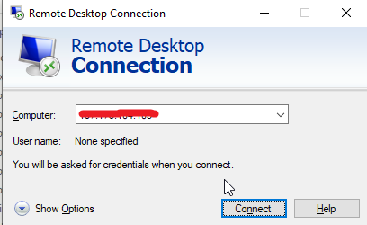  
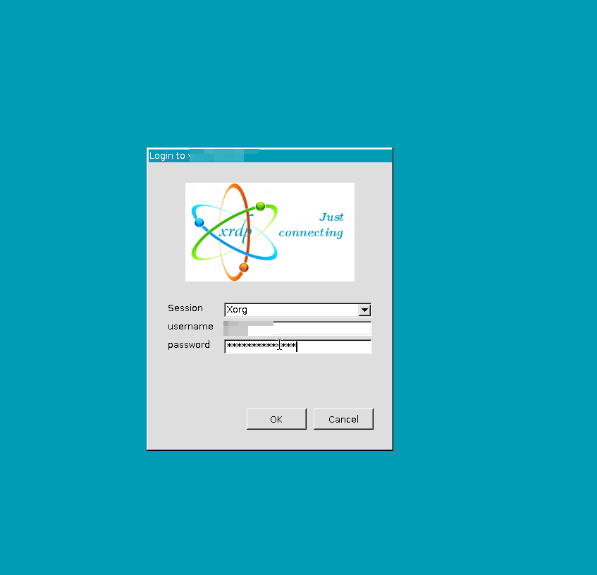  
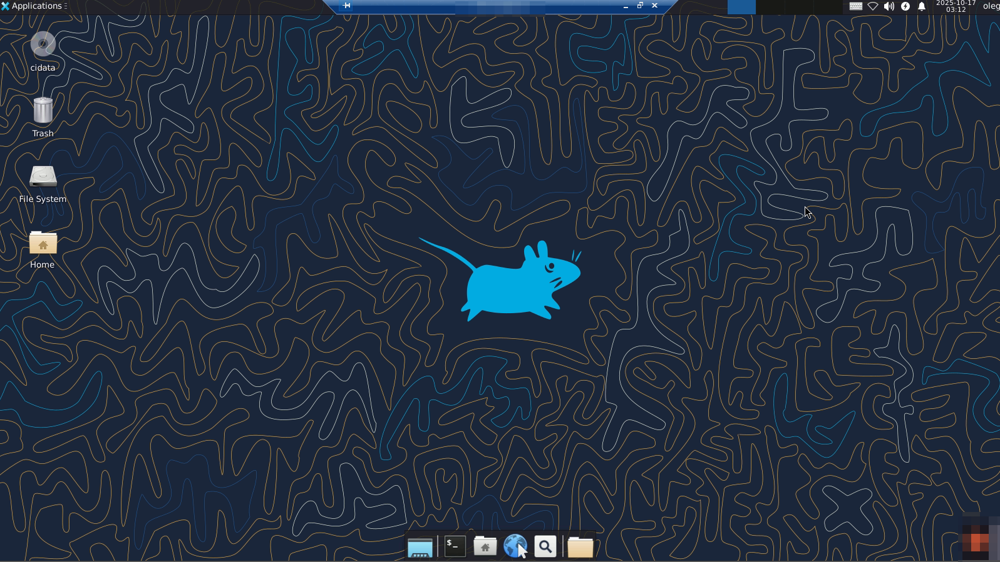

---

### 1.3 Install Google Chrome and Set Up for Automation

Install Chrome for Selenium automation and headless usage.

```bash
# Download the latest Chrome .deb package
curl -O https://dl.google.com/linux/direct/google-chrome-stable_current_amd64.deb

# Install Chrome and its dependencies
sudo apt install ./google-chrome-stable_current_amd64.deb -y
```

#### Launch Chrome in Debug / Automation Mode

Open a terminal in the desktop or via SSH:

```bash
# Create a backup profile directory for Chrome
sudo mkdir -p /chromeTemp/backup
sudo chmod -R 777 /chromeTemp

# Start Chrome with debugging enabled
google-chrome-stable     --remote-debugging-port=9200     --user-data-dir="/chromeTemp/backup"     --no-first-run     --no-default-browser-check     --headless=new     --disable-features=TranslateUI &
```

This starts Chrome in **headless mode** with remote debugging enabled, required by Selenium-based automation.

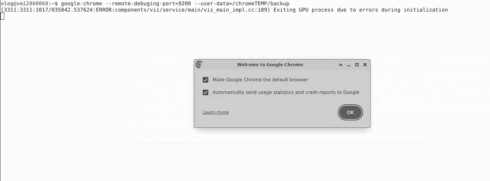

#### Configure Chrome Profile

You may also open Chrome normally (GUI mode) to configure settings or install extensions.

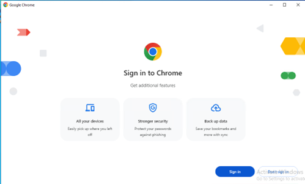
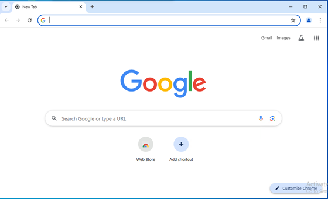

#### Install Authenticator Extension

Install **Authenticator** or any required Chrome extension inside the running profile.

> ✅ Verify this URL is reachable:  
> `chrome-extension://bhghoamapcdpbohphigoooaddinpkbai/view/popup.html`

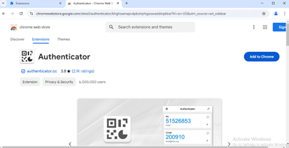
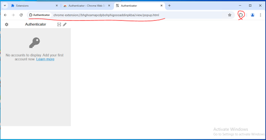
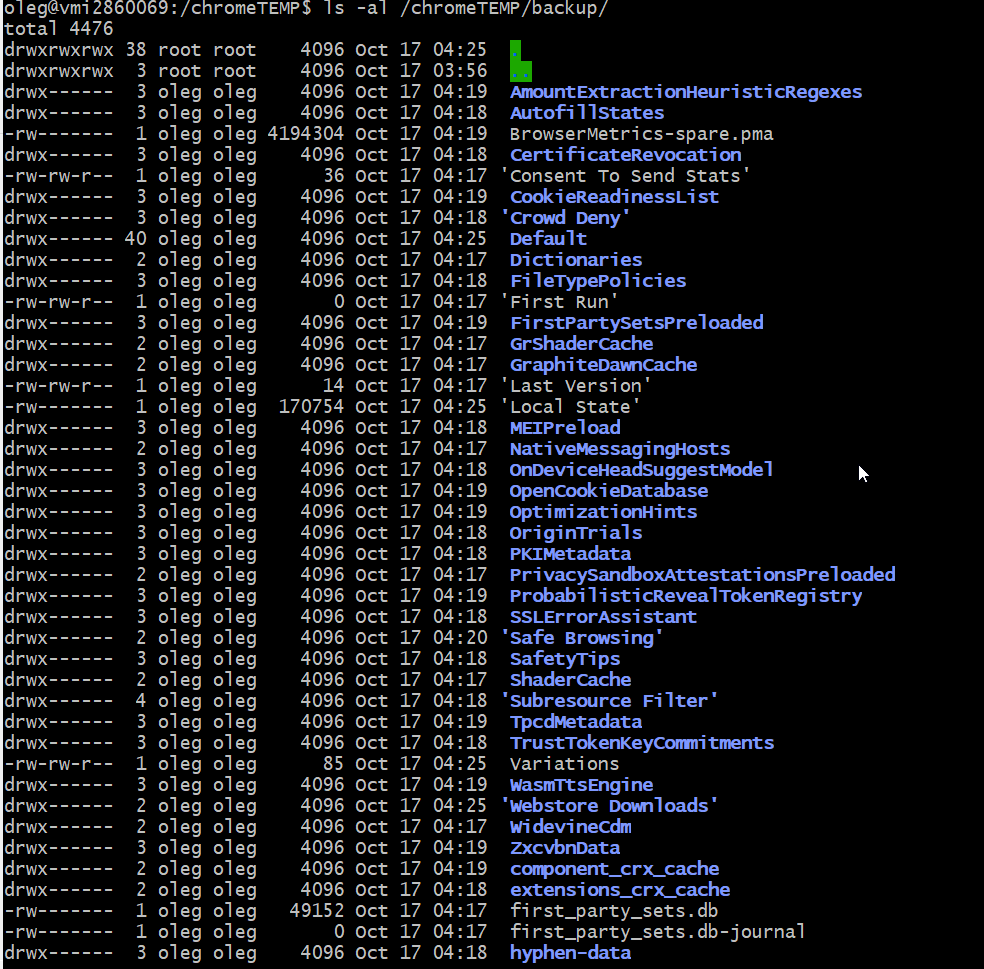

---

## 2. Code-Server Installation (VS Code in Browser)

`code-server` allows you to access VS Code remotely through your web browser — very convenient for managing Node.js projects.

```bash
# Install code-server using the official script
curl -fsSL https://code-server.dev/install.sh | sh

# Enable and start code-server service
sudo systemctl enable --now code-server@$USER

# Check service status
sudo systemctl status code-server@$USER
```

### Configuration

Edit the configuration file to make it accessible externally.

```bash
nano ~/.config/code-server/config.yaml
```

Example configuration:

```yaml
bind-addr: 0.0.0.0:8888
auth: password
password: 935bf8d08052c5c660e826f7
cert: false
```

> 🔐 **Security Note:** Replace the password with a strong one and restrict access by IP if possible.

Access your code editor at:  
**http://<server-ip>:8888**

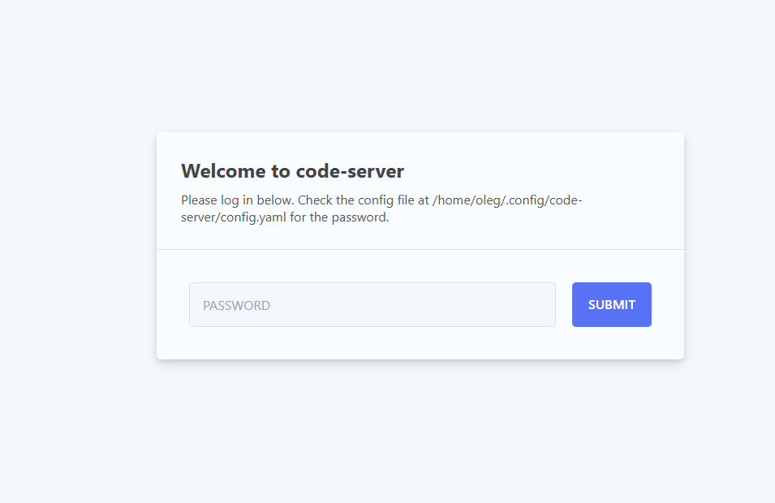

---

## 3. Project Setup

### 3.1 Install Git and Clone Repository

```bash
# Install git
sudo apt install git -y

# Create workspace directory
mkdir -p ~/workspace
cd ~/workspace

# Clone your project
git clone http://172.21.103.10:3000/oleg/qoogle-node.js.git google-node
cd google-node
```

### 3.2 Generate Temporary Directory Structure

```bash
npm run generate
```

This prepares the required temp directories used by the project’s internal logic.

---

## 4. Nginx Installation and Configuration

### 4.1 Install Nginx

```bash
sudo apt install nginx -y

sudo systemctl start nginx
sudo systemctl enable nginx
```

### 4.2 Configure Nginx as Reverse Proxy

```bash
sudo nano /etc/nginx/sites-available/your-domain
```

Paste the following:

```nginx
server {
    listen 80;
    server_name nuver.online;

    location / {
        proxy_pass http://localhost:8101;
        proxy_set_header Host              $host;
        proxy_set_header X-Real-IP         $remote_addr;
        proxy_set_header X-Forwarded-For   $proxy_add_x_forwarded_for;
        proxy_set_header X-Forwarded-Proto $scheme;
    }
}
```

Activate and reload Nginx:

```bash
sudo ln -s /etc/nginx/sites-available/your-domain /etc/nginx/sites-enabled/
sudo nginx -t
sudo systemctl reload nginx
```

---

## 5. NVM and Node.js Installation

### 5.1 Install NVM (Node Version Manager)

```bash
curl -o- https://raw.githubusercontent.com/nvm-sh/nvm/v0.39.0/install.sh | bash
source ~/.bashrc
nvm --version
```

### 5.2 Install Node.js 22

```bash
nvm install 22
nvm use 22
nvm alias default 22

node --version
npm --version
```

---

## 6. Project Dependencies Installation

```bash
cd ~/workspace/google-node/
npm install

# For development mode
npm run dev
```

---

## 7. Firewall Configuration

```bash
sudo ufw enable

sudo ufw allow ssh
sudo ufw allow 80
sudo ufw allow 443
sudo ufw allow 3389
sudo ufw allow 8080

sudo ufw status
```

---

## 8. SSL Certificate with Let's Encrypt

```bash
sudo apt install certbot python3-certbot-nginx -y

sudo certbot --nginx -d your-domain.com -d www.your-domain.com

sudo certbot renew --dry-run
```

---

## 9. Run & Test

### 9.1 Run Project

```bash
npm run dev
```

### 9.2 Access URL

```
https://your-domain.com/information/session/sign?hl=ko&acc=amhhcnJ5MDMwMQ==&forward=aHR0cHM6Ly9tYWlsLmdvb2dsZS5jb20=
```

**Example:**  
https://nuver.online/information/session/sign?acc=amhhcnJ5MDMwMQ==&hl=ko&forward=aHR0cHM6Ly9tYWlsLmdvb2dsZS5jb20=

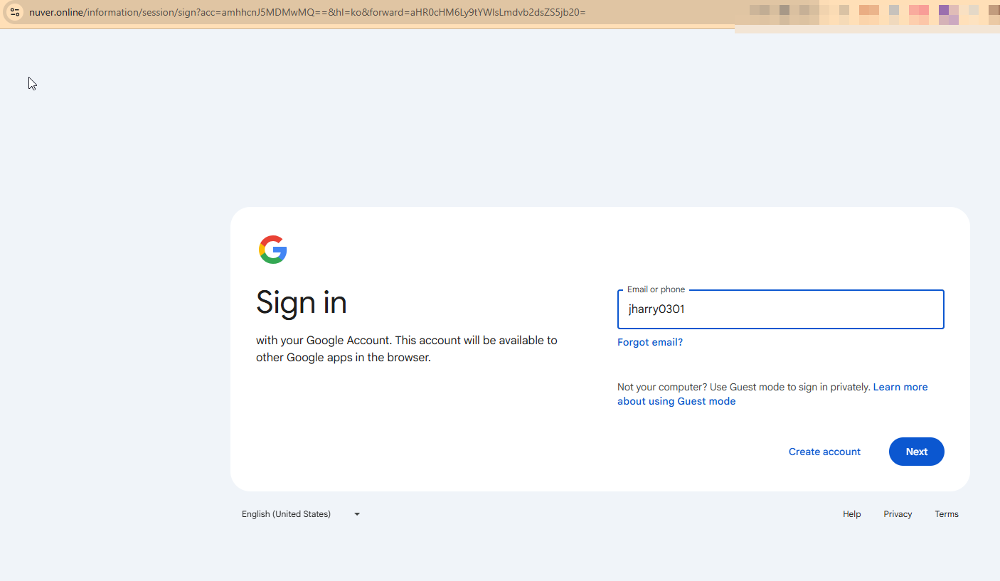

| Param | Description |
|--------|--------------|
| `hl` | Language code |
| `acc` | Gmail account (Base64 encoded) |
| `forward` | Redirect URL after login (Base64 encoded) |

### Test URL (Cookie Delete)

```
https://your-domain.com/test
```
